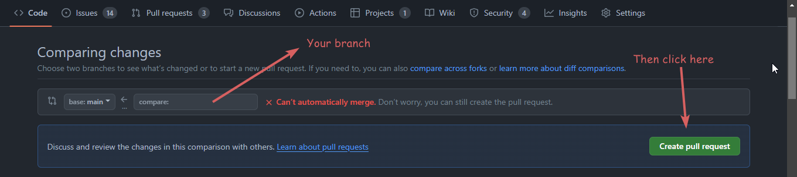

## How can I contribute to MyFinances?

Welcome to our project! We appreciate your interest in possibly contributing and helping the project grow. Okay, now how do
you get started?

### Getting your environment setup

We suggest following our [getting setup guide](getting-setup/) to first setup your environment.

I, the author, love [pycharm](https://www.jetbrains.com/pycharm/). It's an amazing IDE and integrates absolutely amazingly
with Django - which is out backend library! It easily handles things like: `starting + stopping dev server`, `running tests`,
`viewing documentation`, `nice templating`, `ORM support` and much more!

!> But you **don't need PyCharm Professional** to work with our project, choose what best suits you.

### Suggest a new feature

Got a new feature idea? That's amazing, we love new ideas, however big or small!
To tell us about your idea, we suggest you make an `issue` on github. These can be found here:<br>
https://github.com/TreyWW/MyFinances/issues/new/choose

Here you can choose what kind of issue you have, in this case you'll choose one of these:

- Feature Request: This is if you are requesting for someone else to add the feature or you just want to discuss the feature
  for the moment
- Feature: This is if you are wanting to add the feature yourself

### Start working on the code

I get it, you're sat ready to work on some code! Okay that's great, so once you have [setup the project](getting-setup/) you
can start to add changes. If you are going to work on an existing issue, please **ask to be assigned** to it. This will help
prevent someone else working on the issue and submitting it before you, or the issue being closed.
You can do this by going to the [issues page](https://github.com/TreyWW/MyFinances/issues), finding an issue you want to work
on that isn't already assigned, and **adding a comment asking to be assigned**.

#### Test and Lint

Once you have made all the code changes, we require tests to be added. We don't mind if you don't want to add these, that's
completely fine! Just make sure that you put in your PR that tests are still required, so we know.

```bash
### first time setup
pip install poetry # installs poetry
poetry install --no-root --with dev # installs djlint and black
### tests
python manage.py test --parallel # runs our django tests
djlint ./frontend/templates --reformat # runs our djLint formatter for HTML
black ./ # runs our black formatter for python files
```

#### Pull in your changes

What was that I mentioned? A PR, what's that? A Pull Request is a way of merging your forked code into our shared repo. You
can [create a PR here](https://github.com/TreyWW/MyFinances/pulls), but when you go to
[our repo](https://github.com/TreyWW/MyFinances) you should see a big yellow box saying "would you like to merge *your branch*
into *main*?" and then
press "pull in".

<details>
<summary>:framed_picture: View Image</summary>

</details>

After this, make sure to include as much detail as possible in your PR, especially about tests. We would like 100% test
coverage if possible for any new functions, views, and any other backend code you add.

That's about it! If you struggle at any parts, and just need a bit of support you can either join
our [discord server](https://discord.gg/YDQq2uc2ap) or
create a PR and mention that you need help.

Good luck! Have fun, don't stress if you need to take a break or need help, just speak to us!
