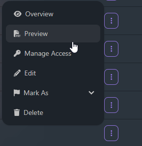
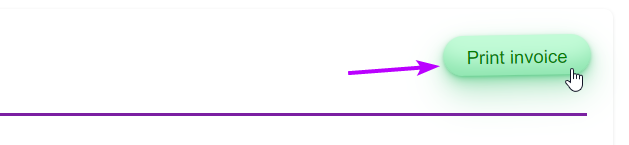
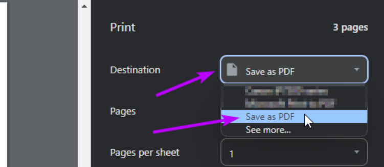

# Download invoice as a PDF

Want to download an invoice as a PDF? Sure thing, let's get started.

First get your invoice created, and head over to the main invoices dashboard. Find your invoice from the list, and click the
three dots on the right - press "Preview"

Now you're on the invoice, press "print invoice", or alternatively press
<kbd>CTRL</kbd> + <kbd>P</kbd> or <kbd>CMD</kbd> + <kbd>P</kbd>

Once the print dialog appears, select "Save as PDF" as the `destination`, and press `save` at the bottom. Now you have a PDF.
This can be sent to clients manually, or kept as a record!

