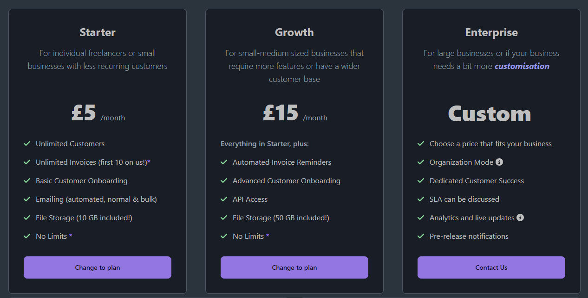

# Pricing

Our cloud version operates using a Subscription + Usage based pricing model. We charge flat per month rates for all plans,
as well as a usage based price.

### Usage Based Pricing

For example, the starter plan has 10 free invoices included with the plan. After that it is £0.05/invoice created.

You may notice that each plan has a different rate for usage. The growth plan includes 8x more invoices and then charges
slightly less per invoice, but with the expense of an increased fixed rate subscription. We have done this to separate
customer groups. Our starter plan focuses on freelancers and solo entrepreneurs where 10 invoices/month should be enough to
get going, and £0.05 for excess isn't too much.

Usage costs are calculated throughout the month via stripe and charged at the end of your billing period on your invoice.

#### Invoices (starter plan)
| Quantity                 | Unit Price        |
|--------------------------|-------------------|
| First 10 invoices        | Included for free |
| Next 40 invoices         | £0.05/invoice     |
| Greater than 50 invoices | £0.035/invoice    |

### Subscription Plans

For each plan, like mentioned above, there is a fixed subscription cost. This is charged at the start of your billing period
and your access to MyFinances will not be granted until payment has been made.

###### _* more details are available on the cloud dashboard_

### Enterprise Plan

The enterprise plan is not just designed for enterprise, large customers. It's for any business, or entrepreneur, that would
like to customise their pricing and feature set to better fit them. E.g. if you don't need customer onboarding, or API access
but would like invoice reminders, we can work that out for a price slightly less!

Either send us an email or book a call to discuss moving to enterprise.

[Send email](mailto:Strelix%20Limited<enterprise@strelix.org>?subject=MyFinances Enterprise Plan){ .md-button  }
<a class="md-button" data-cal-link="treyww/myfinances-development-help"
					data-cal-namespace="myfinances-development-help" data-cal-config='{"layout":"month_view"}'>
	Book a call
</a>

