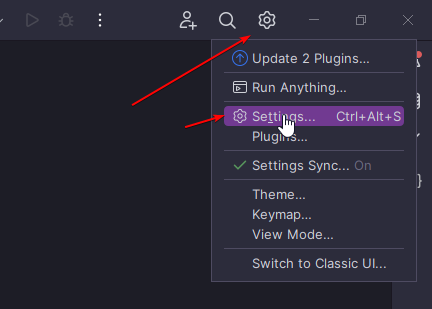
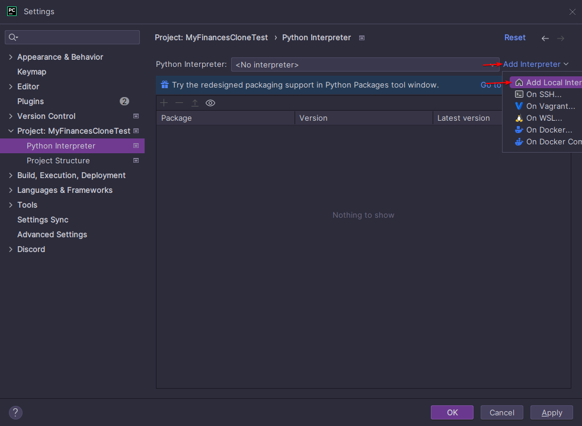
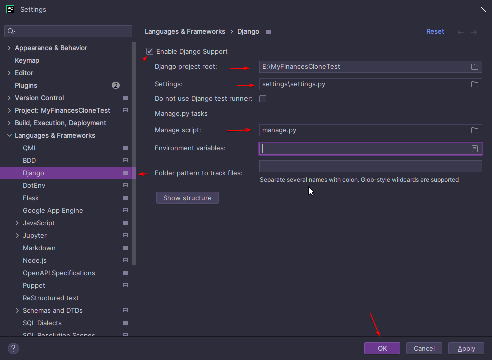
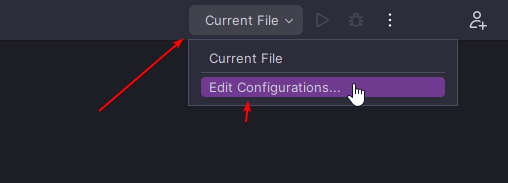

### Index

- [Getting Started](#getting-started)
    - [PyCharm PRO](#pycharm-pro)
    - [No IDE Tools](#no-ide-tools)
    - [Environment Variables](#environment-variables)
        - [PyCharm PRO](#pycharm-pro-1)
    - [Database](#setup-a-local-database)
        - [XAMPP](#xampp-windowslinuxosx)
        - [SQLite](#local-sqlite-database)

# Installation

## Getting Started

1. Fork the project - [Click Here](https://github.com/TreyWW/MyFinances/fork)
   
   
1. Copy the fork URL
   
1. Go to a directory that you want the fork to be in
   
1. Go to your terminal
    <br>
   Press enter
1. Now type

```bash
git clone [fork URL copied from earlier] 

# for example:
# git clone https://github.com/YourUsername/MyFinances.git
```

### PyCharm PRO

1. Go into the folder
   
   and press "OK"
1. Now you should have it loaded up in a new tab.
1. Now go to settings (ctrl + alt +s)
   
1. Now go to your project on the left, and go to "Python Interpreter"
   
1. Now add a local interpreter and select it
   
1. Create a local interpreter
   

> Before continuing, please install all requirements.txt. Go to requirements.txt, right click, press "Install All Packages"

To refresh the cache, go back to settings, project, and interpreter and install "Django" if not already there


7. Go to "Languages And Frameworks" -> "Django"
   Tick "Enable Django Support"
   Make sure Settings, Project Root and Manage script are all set to the correct values



8. Now you need to add django to your runners. Go to "current file" at the top, and press edit configurations
   
   

### No IDE Tools

1. Setup your [environment variables](#environment-variables)
2. Start the server

```bash
python manage.py runserver
```

## Environment Variables

### PyCharm PRO

1. Go to ".env.sample"
2. Press CTRL+A to select all, and CTRL+C to copy them
   

3. Now go to your environment variables section in Run Configuration
   
   
   Then press APPLY and Run!

### Any IDE/None

1. Copy (or move) .env.sample to .env

```bash
cp .env.sample .env
```

## Requirements.txt

```bash
pip install -r requirements.txt
```

or for pycharm, go to requirements.txt, right click -> "Install All Packages"

## Create a user to login with

```bash
python manage.py createsuperuser
```

> Note: Please make sure that the USERNAME is an email, this is the email you login with.

## Setup a local Database

### XAMPP (windows/linux/osX)

1. Install [xampp](https://www.apachefriends.org/)
   
1. Add these [environment variables](#environment-variables)

```dotenv
DATABASE_HOST=127.0.0.1 # leave as 127.0.0.1
DATABASE_NAME=myfinances_development # or the name you gave the database (you will have to create this in localhost/phpmyadmin)
DATABASE_USER=root # leave as root
DATABASE_PASS= # leave blank
```

### Local SQLite Database

Add the [environment variable](#environment-variables)

```dotenv
DATABASE_TYPE=sqlite
```
